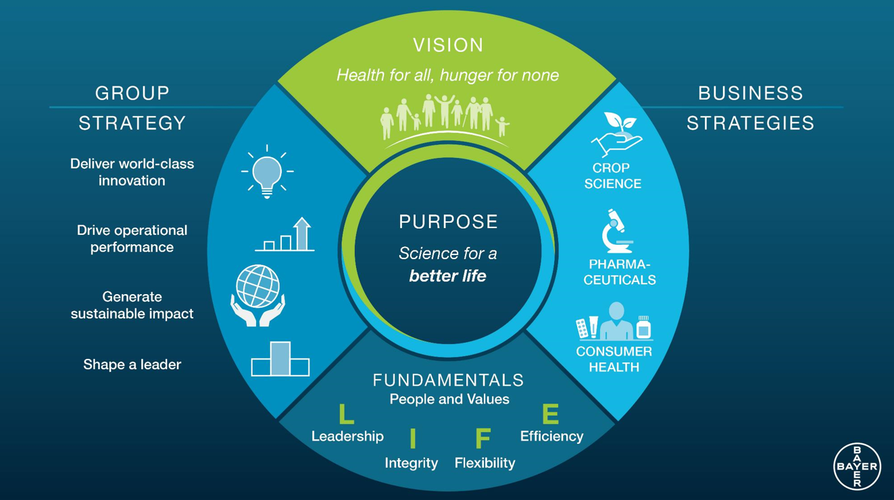

# Welcome to Bayer!

Here at [Bayer](https://www.bayer.com/) we strife for a better life by working towards our motto of "Health for all, hunger for none". We recognize the importance of collaboration and digitilization in achieving this mission and want take part in the community. 
Under the principles of [FAIR code](https://www.go-fair.org/fair-principles/), we have decided to contribute to the open source code community.

## Bayer Open Source Submissions

Welcome! If you're looking to submit a project for open source, please visit our [submission documentation](https://go.bayer.com/opensource).

If you're a reviewer, go look at our [reviewer process documentation](https://go.bayer.com/opensourcereview).

## Selection of Open Source Projects

### COLID

Corporate Linked Data - short: COLID - is a technical solution for corporate environments that provides a metadata repository for corporate assets based upon semantic models.

[More information](https://bayer-group.github.io/COLID-Documentation/#/)
